# Round 2 Roadmap: Smart Emergency Blood Network (SEBN) - The Slingshot

> This document outlines planned enhancements for Round 2 of SEBN, focusing on operational maturity and reliability.

**Round 2 - The Slingshot** focuses on strengthening reliability, decision support, governance, and operational clarity, building directly on the validated foundation from Round 1.

No new problem domain or emergency type is introduced in this phase.

---

## Evolution: Round 1 → Round 2

```mermaid
graph LR
    Round1["🔵 ROUND 1<br/>Foundation"]
    Round2["🟢 ROUND 2<br/>Enhancement"]
    
    Round1 -->|Strengthen| Round2
    
    R1Content["• Basic Workflows<br/>• Role-Based Access<br/>• Emergency Flow<br/>• Audit Logs<br/>• Data Model"]
    
    R2Content["✨ Smart Prioritization<br/>✨ Advanced Escalation<br/>✨ Auto Notifications<br/>✨ Analytics Dashboards<br/>✨ Enhanced Compliance"]
    
    Round1 --- R1Content
    Round2 --- R2Content
    
    style Round1 fill:#1565c0,stroke:#0d47a1,stroke-width:2px,color:#fff
    style Round2 fill:#2e7d32,stroke:#1b5e20,stroke-width:2px,color:#fff
    style R1Content fill:#1565c0,stroke:#0d47a1,stroke-width:1px,color:#fff
    style R2Content fill:#2e7d32,stroke:#1b5e20,stroke-width:1px,color:#fff
```

---

## 1. Scope of Round 1 (Baseline)

Round 1 focused on establishing a strong and realistic foundation, including:

- Governed organization onboarding and approval
- Role-based access (Super Admin, Organization Admin, Staff)
- Emergency blood request workflow
- Blood bank stock management
- NGO donor and camp management
- Audit-oriented data modeling and system flows

Round 1 validates system design, feasibility, and correctness.

---

## 2. Identified Gaps After Round 1

Based on the current implementation and system design, the following refinement areas are identified:

- Emergency prioritization logic is rule-based and can be enhanced with additional contextual factors
- Radius-based search escalation is static and can be made more adaptive
- Alerts and escalation exist but can be strengthened with time-based and multi-stage logic
- Admin dashboards provide operational visibility but limited historical and trend-based insights
- Performance and reliability optimizations are not yet tuned for higher load scenarios

These observations guide the Round 2 roadmap.

### Gap Analysis Visualization

---
---

## 3. Planned Enhancements for Round 2

### Enhancement Priority & Impact Matrix

```mermaid
graph TB
    subgraph Priority["HIGH PRIORITY & HIGH IMPACT"]
        E1["⭐ Intelligent Prioritization<br/>Priority: 0.9, Impact: 0.95"]
        E2["⭐ Auto Notifications<br/>Priority: 0.88, Impact: 0.92"]
        E3["⭐ Advanced Escalation<br/>Priority: 0.85, Impact: 0.90"]
        E4["⭐ Reliability Improvements<br/>Priority: 0.85, Impact: 0.90"]
    end
    
    subgraph Secondary["MEDIUM PRIORITY & IMPACT"]
        E5["📊 Performance Optimization<br/>Priority: 0.80, Impact: 0.88"]
        E6["🔒 Security Enhancements<br/>Priority: 0.75, Impact: 0.85"]
        E7["📈 Analytics Dashboards<br/>Priority: 0.75, Impact: 0.80"]
    end
    
    subgraph Lower["LOWER PRIORITY"]
        E8["📋 Audit Enhancements<br/>Priority: 0.70, Impact: 0.75"]
    end
    
    style Priority fill:#2e7d32,stroke:#1b5e20,stroke-width:2px,color:#fff
    style Secondary fill:#f57f17,stroke:#e65100,stroke-width:2px,color:#fff
    style Lower fill:#bf360c,stroke:#5d4037,stroke-width:2px,color:#fff
    style E1 fill:#1b5e20,stroke:#003300,stroke-width:2px,color:#fff
    style E2 fill:#1b5e20,stroke:#003300,stroke-width:2px,color:#fff
    style E3 fill:#1b5e20,stroke:#003300,stroke-width:2px,color:#fff
    style E4 fill:#1b5e20,stroke:#003300,stroke-width:2px,color:#fff
```

### 3.1 Priority-Based Request Support

**What will be added**

System-assisted prioritization of blood requests based on:
- Urgency level
- Blood group rarity
- Time since request creation

Priority visibility for:
- Super Admin
- Blood Banks
- Hospital staff (to understand queue position)

**Why**
- Helps stakeholders focus on critical cases
- Provides transparency into request handling
- Reduces uncertainty during emergencies

**How it works**
- System calculates and displays priority scores
- Staff make informed decisions based on prioritized queue
- Admins can review prioritization logic and override if needed

```mermaid
graph LR
    Request["Blood Request<br/>Received"]
    Analysis["Analyze:<br/>Urgency, Rarity,<br/>Time, Trends"]
    Priority["Calculate<br/>Priority Score"]
    Queue["Prioritized Queue<br/>CRITICAL → HIGH → MEDIUM"]
    Search["Execute Search<br/>by Priority"]
    
    Request --> Analysis
    Analysis --> Priority
    Priority --> Queue
    Queue --> Search
    
    style Request fill:#e65100,stroke:#bf360c,stroke-width:2px,color:#fff
    style Analysis fill:#1565c0,stroke:#0d47a1,stroke-width:2px,color:#fff
    style Priority fill:#c62828,stroke:#ad1457,stroke-width:2px,color:#fff
    style Queue fill:#6a1b9a,stroke:#4a148c,stroke-width:2px,color:#fff
    style Search fill:#2e7d32,stroke:#1b5e20,stroke-width:2px,color:#fff
```

### 3.2 System-Assisted Escalation Logic

**What will be improved**

- System recommendations for radius expansion (when blood not found in initial radius)
- Manual confirmation required before escalating
- Clear visibility into escalation triggers and reasoning
- Configurable escalation policies per organization

**Why**

- Prevents unnecessary broad searches
- Maintains human oversight in sensitive decisions
- Reduces donor fatigue from over-escalation
- Improves search efficiency

**How it works**

- System detects when initial search yields no results
- Recommends next escalation step to authorized staff
- Staff confirms or adjusts escalation decision
- All decisions logged for audit trail

### 3.3 Structured Notification & Status Updates

**What will be added**

Notifications at key lifecycle stages:
- Request created (acknowledgment)
- Escalation recommended (with reasoning)
- Escalation confirmed (status update)
- Resolution or unresolved (final status)

Delivery methods:
- In-app alerts with full context
- Dashboard status indicators
- Clear timestamps and action trails

**Why**

- Reduces need for manual status checks
- Keeps all stakeholders informed at critical moments
- Provides clear audit trail of communication

**Principle**
- Notifications inform, they don't command
- Human staff remain in control of escalation decisions
- Every notification includes reasoning and options

```mermaid
graph TB
    Event["Request Event<br/>Created/Delayed"]
    
    subgraph Stages["ESCALATION STAGES"]
        Stage1["Stage 1: Immediate<br/>Blood Banks Notified"]
        Stage2["Stage 2: 10 min delay<br/>NGO Alert"]
        Stage3["Stage 3: 30 min delay<br/>Admin Alert"]
        Stage4["Stage 4: 1 hour delay<br/>Critical Alert"]
    end
    
    Notify1["📱 In-App Notification"]
    Notify3["🔔 Dashboard Alert"]
    
    Event --> Stage1
    Stage1 --> Notify1
    
    Notify1 -->|Wait 10 min| Stage2
    Stage2 --> Notify3
    
    Notify3 -->|Wait 20 min| Stage3
    Stage3 --> Notify3
    
    Notify3 -->|Wait 30 min| Stage4
    
    style Event fill:#e65100,stroke:#bf360c,stroke-width:2px,color:#fff
    style Stages fill:#4a148c,stroke:#38006b,stroke-width:2px,color:#fff
    style Stage1 fill:#f57f17,stroke:#e65100,stroke-width:2px,color:#fff
    style Stage2 fill:#f44336,stroke:#d32f2f,stroke-width:2px,color:#fff
    style Stage3 fill:#c62828,stroke:#ad1457,stroke-width:2px,color:#fff
    style Stage4 fill:#880e4f,stroke:#4a148c,stroke-width:2px,color:#fff
    style Notify1 fill:#2e7d32,stroke:#1b5e20,stroke-width:2px,color:#fff
    style Notify2 fill:#1565c0,stroke:#0d47a1,stroke-width:2px,color:#fff
    style Notify3 fill:#6a1b9a,stroke:#4a148c,stroke-width:2px,color:#fff
```

### 3.4 Admin Operational Dashboard

**What will be added**

Admin interface showing:
- Current request queue and status
- Resolution times (average and by organization)
- Escalation frequency and patterns
- Organization activity overview
- Recent audit log entries

**Why**

- Enables data-informed decision making
- Improves system transparency
- Helps identify bottlenecks and patterns

**Scope**
- Real-time operational metrics (not predictive analytics)
- Historical trends within reasonable data retention
- Filtered views per organization/role
- No AI/ML or advanced prediction models

```mermaid
graph TB
    Dashboard["Admin Analytics Dashboard"]
    
    Dashboard --> Metrics["📊 Key Metrics"]
    Dashboard --> Trends["📈 Trends"]
    Dashboard --> Reports["📋 Reports"]
    
    Metrics --> M1["Avg Resolution Time"]
    Metrics --> M2["Success Rate %"]
    Metrics --> M3["Unresolved Cases"]
    
    Trends --> T1["Blood Stock Levels"]
    Trends --> T2["Request Volume"]
    Trends --> T3["Donor Participation"]
    
    Reports --> R1["Organization Reports"]
    Reports --> R2["Emergency Analysis"]
    Reports --> R3["Compliance Reports"]
    
    style Dashboard fill:#1a0f2e,stroke:#000,stroke-width:2px,color:#fff
    style Metrics fill:#1565c0,stroke:#0d47a1,stroke-width:2px,color:#fff
    style Trends fill:#e65100,stroke:#bf360c,stroke-width:2px,color:#fff
    style Reports fill:#2e7d32,stroke:#1b5e20,stroke-width:2px,color:#fff
```

### 3.5 Strengthened Audit & Compliance Layer

**What will be improved**

- More detailed audit logs
- Action categorization and severity tagging
- Advanced filtering and search for audit records

**Why**

- Enhances accountability
- Prepares the system for institutional or regulatory review

---

## 4. Technical Improvements (Round 2)

### 4.1 Performance Readiness

- Database query optimization for high-traffic searches
- Proper indexing on blood group, location, availability fields
- Pagination to prevent large result sets
- Rate limiting to prevent abuse during peak load

### 4.2 Reliability Improvements

- Graceful error handling with clear user feedback
- Fallback workflows when primary search fails
- Partial failure handling (e.g., one blood bank unavailable doesn't break system)
- API timeout and retry logic

**Note**: These are design-level improvements, not infrastructure scaling claims. Actual deployment scaling decisions will be made based on real usage patterns.

---

## 5. Security & Access Control Refinement

**Planned Improvements**

- Action-level permission validation (not just role checks)
- Organization boundary enforcement (data isolation)
- Audit logging for all administrative actions
- Monitoring for unusual patterns (manual review, not automated blocking)

**Goal**: Maintain trust in a multi-organization environment through transparency and controlled access.

**What this does NOT include**:
- Automated threat detection
- Real-time security scoring
- Advanced compliance certifications
- Enterprise security frameworks

These may be considered after the core system proves stable in production.

```mermaid
graph TD
    Request["Request"]
    
    AuthLayer["1. Authentication<br/>Verify User Identity"]
    RBACLayer["2. RBAC Layer<br/>Check Role Permissions"]
    ActionLayer["3. Action-Level<br/>Validate Specific Action"]
    OrgLayer["4. Organization<br/>Scope Check"]
    AnomalyLayer["5. Anomaly Detection<br/>Pattern Analysis"]
    
    Execute["✅ Execute"]
    Deny["❌ Deny + Alert"]
    
    Request --> AuthLayer
    AuthLayer -->|Pass| RBACLayer
    AuthLayer -->|Fail| Deny
    
    RBACLayer -->|Pass| ActionLayer
    RBACLayer -->|Fail| Deny
    
    ActionLayer -->|Pass| OrgLayer
    ActionLayer -->|Fail| Deny
    
    OrgLayer -->|Pass| AnomalyLayer
    OrgLayer -->|Fail| Deny
    
    AnomalyLayer -->|Normal| Execute
    AnomalyLayer -->|Suspicious| Deny
    
    style AuthLayer fill:#1565c0,stroke:#0d47a1,stroke-width:2px,color:#fff
    style RBACLayer fill:#1565c0,stroke:#0d47a1,stroke-width:2px,color:#fff
    style ActionLayer fill:#1565c0,stroke:#0d47a1,stroke-width:2px,color:#fff
    style OrgLayer fill:#1565c0,stroke:#0d47a1,stroke-width:2px,color:#fff
    style AnomalyLayer fill:#c62828,stroke:#ad1457,stroke-width:2px,color:#fff
    style Execute fill:#2e7d32,stroke:#1b5e20,stroke-width:2px,color:#fff
    style Deny fill:#c62828,stroke:#ad1457,stroke-width:2px,color:#fff
```

---

## 6. Out of Scope for Round 2 (Explicitly Stated)

To avoid over-extension, the following are intentionally excluded from Round 2:

- Expansion to non-blood emergency resources
- AI/ML-based prediction models
- Nationwide deployment claims
- Replacement of existing government systems

These may be considered only after core stability is achieved.

---

## 7. Hackathon Progression Overview

### Round 1 Deliverables (Foundation)

**✅ Completed Components**:
- Governed organization onboarding and approval workflow
- Role-based access control (Super Admin, Organization Admin, Staff)
- Emergency blood request processing flow
- Blood bank stock management system
- NGO donor and camp management
- Complete audit logging and tracking
- Core data models and API infrastructure

**Outcome**: Validated proof-of-concept with core workflows functioning

---

### Round 2 Deliverables (The Slingshot - Operational Maturity)

**🟡 In Development - Key Enhancements**:
1. **Priority-Based Request Support**
   - System-assisted prioritization (urgency, rarity, time)
   - Queue visibility for all stakeholders
   - Admin override capabilities

2. **System-Assisted Escalation Logic**
   - Multi-stage radius expansion (5KM → 15KM → 50KM)
   - Manual confirmation required for each escalation
   - Escalation reasoning and audit trail

3. **Structured Notifications & Status Updates**
   - In-app alerts at critical lifecycle stages
   - Dashboard status indicators
   - Complete communication audit trail

4. **Admin Operational Dashboard**
   - Real-time request queue and status visibility
   - Resolution time metrics and patterns
   - Escalation frequency analysis
   - Organization activity overview

5. **Strengthened Audit & Compliance Layer**
   - Enhanced audit logging with action categorization
   - Advanced filtering and search capabilities
   - Compliance-ready audit trails

6. **Performance & Reliability Improvements**
   - Database query optimization and proper indexing
   - Graceful error handling with fallback workflows
   - API timeout and retry logic
   - Rate limiting and load handling

---

---

## 8. Round 2 Overview & Closure

Round 2 focuses on strengthening the operational clarity and reliability of SEBN without expanding its original scope.

The work in this phase centers on:
- Making emergency request handling more structured through visible prioritization.
- Supporting escalation decisions with system recommendations while keeping humans in control.
- Improving transparency through clearer request status, history, and audit visibility.
- Ensuring core workflows remain stable as usage increases.

This phase does not aim to introduce new emergency domains or advanced automation.  
Instead, it emphasizes clarity, governance, and controlled coordination for real-world blood emergency scenarios.

### Explicit Focus Boundaries

To avoid over-extension, the following are intentionally not addressed in Round 2:
- Nationwide deployment readiness
- Autonomous or AI-driven decision-making
- Predictive or forecasting systems
- Formal security certifications
- Replacement of existing government healthcare platforms

Round 2 serves as a consolidation phase, ensuring that the system’s behavior, decisions, and data flows are understandable, traceable, and reliable before any future expansion is considered.

## 9. Conclusion

Round 2 transitions SEBN from **proof-of-concept design** to **operationally mature system** suitable for real-world blood emergency coordination.

**Focus remains on:**
- Blood emergency management only (no scope expansion)
- System-assisted decision making (humans in control)
- Reliability and transparency (not autonomous automation)
- Accountability and auditability (full decision trails)
- Realistic scaling (based on actual usage, not theoretical claims)

### Round 2 Vision

**A faster, safer, and more transparent emergency blood coordination platform where system intelligence supports human decision-making.**

---