# Smart Emergency Blood Network (SEBN)

> A governed digital network that connects hospitals, blood banks, and NGOs to enable fast, reliable, and auditable blood access during emergency and critical conditions.

---

## (Quick Overview)

**SEBN** is a centrally governed emergency blood coordination platform designed to replace fragmented and manual blood discovery processes during critical situations.

### What it does:
- Digitizes emergency blood discovery and coordination
- Uses progressive radius-based escalation with NGO donor fallback
- Maintains end-to-end auditability through admin governance
- Architected with scalability, reliability, and operational clarity

**Round 2 - The Slingshot** focuses on strengthening scalability, reliability, automation, and administrative oversight, building on a validated Round 1 foundation.

## Problem Statement

During medical emergencies and rare blood group requirements, hospitals often struggle to locate blood in time. The current process relies heavily on:
- Manual phone calls
- Fragmented information
- Informal coordination between hospitals, blood banks, and donor groups

This results in **delays, uncertainty, and inefficiency** during critical situations.

### Limitations of Existing Systems

| Issue | Impact |
|-------|--------|
| Manual calling of multiple blood banks | Time-consuming, error-prone |
| Limited or fragmented visibility of blood stock | Uncertainty during emergencies |
| Poor coordination between stakeholders | Information silos |
| Lack of verified and governed access | Trust and compliance issues |
| No structured fallback mechanism | Requests may go unfulfilled |
| Minimal auditability and accountability | No compliance trail |

## Core Solution

SEBN introduces a **centrally governed emergency blood network** where verified hospitals, blood banks, and NGOs operate on a single platform.

> **Note:** SEBN is designed as a **decision-support and coordination system**, not as a replacement for existing blood bank operations.

### System Workflow

```
1️⃣ Hospital raises a blood requirement request
                        ⬇️
2️⃣ System searches nearby blood banks using real-time stock
                        ⬇️
3️⃣ If not found → Search radius expands progressively
                        ⬇️
4️⃣ If still unavailable → NGOs are triggered as fallback
                        ⬇️
5️⃣ Hospital receives confirmed availability with complete details
                        ⬇️
6️⃣ Admin monitors and audits the complete request lifecycle
```

### Emergency Request Processing Flow

```mermaid
flowchart TD
    H["🏥 Hospital<br/>Raises Request"]
    S["🔍 Search Nearby<br/>Blood Banks"]
    F1{"✓ Blood<br/>Found?"}
    R["📊 Return Results<br/>to Hospital"]
    E["📍 Expand Search<br/>Radius"]
    F2{"✓ Still Not<br/>Found?"}
    N["🤝 Contact NGO<br/>Donor Network"]
    F3{"✓ Donors<br/>Available?"}
    E2["❌ No Options<br/>Escalate Alert"]
    L["📋 Log to<br/>Audit Trail"]
    
    H --> S
    S --> F1
    F1 -->|YES| R
    F1 -->|NO| E
    E --> F2
    F2 -->|YES| R
    F2 -->|NO| N
    N --> F3
    F3 -->|YES| R
    F3 -->|NO| E2
    
    R --> L
    E2 --> L
    
    style H fill:#ff9800,stroke:#e65100,stroke-width:2px,color:#fff
    style S fill:#1976d2,stroke:#0d47a1,stroke-width:2px,color:#fff
    style F1 fill:#f57f17,stroke:#e65100,stroke-width:2px,color:#fff
    style F2 fill:#f57f17,stroke:#e65100,stroke-width:2px,color:#fff
    style F3 fill:#f57f17,stroke:#e65100,stroke-width:2px,color:#fff
    style E fill:#d32f2f,stroke:#b71c1c,stroke-width:2px,color:#fff
    style E2 fill:#c62828,stroke:#b71c1c,stroke-width:2px,color:#fff
    style N fill:#7b1fa2,stroke:#4a148c,stroke-width:2px,color:#fff
    style R fill:#388e3c,stroke:#1b5e20,stroke-width:2px,color:#fff
    style L fill:#455a64,stroke:#263238,stroke-width:2px,color:#fff
```



(Detailed flows and DFDs are documented separately.)

## Key Differentiators (USP)

### Problem vs Solution Visualization


**Key Differentiators (USP)**:

-  **Real-time blood stock visibility** across verified blood banks
-  **Single portal** for blood bank discovery and donor identification
-  **Progressive radius-based emergency search** with intelligent escalation
-  **NGO-backed donor fallback mechanism** for rare or unavailable blood
-  **Admin-governed trust model** (verification, rules, audit logs)
-  **Emergency-first system design** (not a generic inventory app)

## Stakeholders & Roles

### Stakeholder Interaction Model

```mermaid
graph TB
    Admin["👨‍💼 Super Admin<br/>Platform Control"]
    Hospital["🏥 Hospital<br/>Emergency Requests"]
    BloodBank["🩸 Blood Bank<br/>Stock Provider"]
    NGO["🤝 NGO<br/>Donor Network"]
    
    Admin -->|Approves| Hospital
    Admin -->|Approves| BloodBank
    Admin -->|Approves| NGO
    Admin -->|Monitors| Hospital
    Admin -->|Monitors| BloodBank
    Admin -->|Monitors| NGO
    
    Hospital -->|Searches| BloodBank
    Hospital -->|Escalates to| NGO
    
    BloodBank -->|Updates Stock| BloodBank
    NGO -->|Organizes Camps| NGO
    
    style Admin fill:#c62828,stroke:#b71c1c,stroke-width:2px,color:#fff
    style Hospital fill:#e65100,stroke:#bf360c,stroke-width:2px,color:#fff
    style BloodBank fill:#0d47a1,stroke:#051c7c,stroke-width:2px,color:#fff
    style NGO fill:#4a148c,stroke:#38006b,stroke-width:2px,color:#fff
```



### Hospitals
- Raise blood emergency requests
- View available blood and donor options
- Do not manually contact blood banks

### Blood Banks
- Maintain and update blood stock regularly
- Act as the primary blood source
- Operate only after admin verification

### NGOs
- Organize blood donation camps
- Maintain active donor data
- Act as fallback donor providers during shortages

### Admin
- Verify hospitals, blood banks, and NGOs
- Define system rules and escalation logic
- Monitor activity and maintain audit logs
- Ensure data reliability and system integrity

## Technology Stack

### System Architecture Overview


**Technology Stack:**

### Frontend
- **React** (mobile-first design)

### Backend
- **Node.js**
- **Express.js**

### Database
- **MongoDB** (native driver)

---

## Scalability & Growth Strategy (Round 2 - The Slingshot)

SEBN is architected as a **stateless, API-driven system** with scalability treated as a design principle rather than a deployment claim.

### Round 2 - The Slingshot Improvements Roadmap

```mermaid
graph TB
    Round1["🎯 Round 1<br/>Foundation"]
    
    subgraph Round2Improvements["Round 2 - The Slingshot Enhancements"]
        Scalability["⚡ Scalability<br/>- Horizontal API scaling<br/>- Indexed MongoDB queries<br/>- Read optimization"]
        Reliability["🛡️ Reliability<br/>- Multi-stage escalation<br/>- Error handling<br/>- Auto fallback"]
        Automation["🤖 Automation<br/>- Auto Priority Scoring<br/>- Priority Request Queue<br/>- Smart Fallback Routing<br/>- Controlled Radius Expansion"]
        Operations["📊 Operations<br/>- Enhanced audit trails<br/>- Admin dashboards<br/>- Performance monitoring"]
    end
    
    subgraph Outcomes["Outcomes"]
        OutSpeed["✅ Faster Response<br/>Times"]
        OutReliability["✅ Higher Success<br/>Rate"]
        OutGrowth["✅ Ready for<br/>Expansion"]
        OutTrust["✅ Improved Trust &<br/>Compliance"]
    end
    
    Round1 --> Round2Improvements
    Scalability --> OutSpeed
    Reliability --> OutReliability
    Automation --> OutGrowth
    Operations --> OutTrust
    
    style Round1 fill:#2196F3,stroke:#1976D2,stroke-width:2px,color:#fff
    style Round2Improvements fill:#FF9800,stroke:#F57F17,stroke-width:2px,color:#fff
    style Outcomes fill:#4CAF50,stroke:#2E7D32,stroke-width:2px,color:#fff
    style Scalability fill:#FFC107,stroke:#F57F17,stroke-width:2px,color:#000
    style Reliability fill:#F44336,stroke:#C62828,stroke-width:2px,color:#fff
    style Automation fill:#9C27B0,stroke:#6A1B9A,stroke-width:2px,color:#fff
    style Operations fill:#00BCD4,stroke:#00838F,stroke-width:2px,color:#fff
```



### Handling Increased Users & Requests

- **Backend APIs** are designed to remain stateless, enabling horizontal scaling behind a load balancer as demand increases
- **MongoDB collections** are structured and indexed on high-traffic attributes (blood group, location, availability)
- **Read-heavy operations** optimized to reduce response latency under increased load
- **Pagination & rate limiting** incorporated to prevent overload during peak emergency traffic

### Growth Readiness

- **Modular design** enables future independent scaling without architectural refactoring
- **Organization-level data isolation** helps prevent cross-tenant performance impact
- **Flexible onboarding** - New hospitals, blood banks, and NGOs can be added through approval workflows


---

## Reliability & Failure Handling

SEBN is designed to operate reliably under **real-world emergency conditions**, including partial system failures.

### Failure Scenarios & Mitigation

| Scenario | Mitigation Strategy |
|----------|-------------------|
| Nearby blood banks unavailable | Automatic radius escalation |
| Stock-based searches fail | NGO donor fallback |
| Multi-point failures | Multi-stage escalation ensures resolution |
| System errors | Comprehensive logging for recovery |

### Operational Safety

- **Graceful error handling** prevents cascading failures
- **Admin intervention capability** to override automated flows when required
- **Complete audit trails** support accountability and post-incident analysis

---

## Core Concepts

- Role-based access control
- Location-based search
- Rule-driven emergency handling
- Audit-oriented system design

---

## Documentation Structure

This repository includes multiple focused documentation files. **Click on any file below to view its contents:**

| Document | Purpose |
|----------|---------|
| [**SYSTEM_FLOW.md**](Main%20Documentation/SYSTEM_FLOW.md) | Detailed flow charts and DFDs |
| [**ARCHITECTURE.md**](Main%20Documentation/Architecture.md) | Backend architecture and module design |
| [**DATA_MODEL.md**](Main%20Documentation/DATA_MODEL.md) | Database schemas and relationships |
| [**ROUND2_ROADMAP.md**](Main%20Documentation/ROUND2_ROADMAP.md) | Planned improvements and feature expansion |
| [**COMPETITIVE_ANALYSIS.md**](Main%20Documentation/Analyticscopy.md) | Positioning against existing platforms |


---

## Team Contributions

| Role | Responsibility |
|------|-----------------|
| **System Architecture & Backend Design** | Core workflows, escalation logic, API design |
| **Documentation & Diagrams** | System flows, governance model, Round 2 planning |
| **Research & Validation** | Emergency workflows, feasibility analysis, scope definition |

> Work was divided with clear ownership while maintaining collaborative design decisions.

---

## Current Status

### Round 1 Achievements
- System design finalized
- Stakeholder roles clearly defined
- Emergency handling logic documented
- Governance and admin control model established

> **Round 1** focuses on validating the system design, workflows, and technical feasibility.

> **Round 2 - The Slingshot** focuses on scalability, reliability, and operational maturity.

---

## Scope Clarification

SEBN currently focuses **exclusively on blood emergency management**. While the architecture supports future expansion, non-blood emergency resources are intentionally out of scope for Round 2 - The Slingshot.

---

## Conclusion

SEBN replaces fragmented and manual blood search processes with a **trusted, automated, and scalable emergency coordination network**. By combining governance, escalation logic, and auditability, the platform enables faster and more reliable responses during critical medical situations.

---

## Resources & Links

| Resource | Link |
|----------|------|
| **Demo** | [View Demo Video](https://drive.google.com/drive/folders/1splVdZoQxYmd0r-DX-u-tqTPUxqSP3fD?usp=sharing) |
| **Postman (Admin)** | [API Documentation](https://documenter.getpostman.com/view/39216723/2sBXVbJuPe) |
| **Postman (Hospital)** | [API Documentation](https://documenter.getpostman.com/view/39215245/2sBXVbJuTv) |
| **Postman (Blood Bank)** | [API Documentation](https://documenter.getpostman.com/view/39189509/2sBXVfiBEH) |

---

<div align="center">
  
**Made with ❤️ for Emergency Blood Management**

*Saving lives through technology and coordination*

</div>
